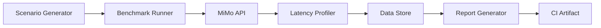

# Architecture

## Layers

### Scenario Layer
Generates structured test prompts for each workload pattern. Scenarios are parameterized to allow variation in context size, tool count, and concurrency.

### Runner Layer
Executes scenarios against live MiMo endpoints with configurable concurrency and iteration counts.

### Profiling Layer
Collects per-call latency metrics: TTFT, TPOT, E2E at P50/P95/P99 percentiles.

### Analysis Layer
Aggregates profiling data into structured reports with regression detection.
